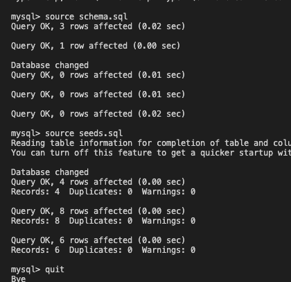

# TrackingEmployees 

### Walkthrough Video
- [Video Guide](https://drive.google.com/file/d/1bWSbwIapqJ4NVODgKEUeOZJMZgPUok4h/view)

### Github : https://github.com/kevinl206/TrackingEmployees.git

## Table of Contents
- [Description](#description)
- [Installation](#installation)
- [Github](#github)
- [Email](#email)
- [Questions](#questions)
  
## Description
    
[Back to top](#)
  
## Installation
- Download and install "NPM install".
- Then run "node server.js" in your terminal.
- Then run this command in your mysql terminal:
"source schema.sql;"
- Next
"source seeds.sql;"
- After that
"exit"

[Back to top](#)
  
## Screenshot of Example

[Back to top](#)
  
 ## Email
      kevinl206@yahoo.com
[Back to top](#)
  
## Questions
  any additional questions, feel free to reach out to me via [email](mailto:kevinl206@yahoo.com).